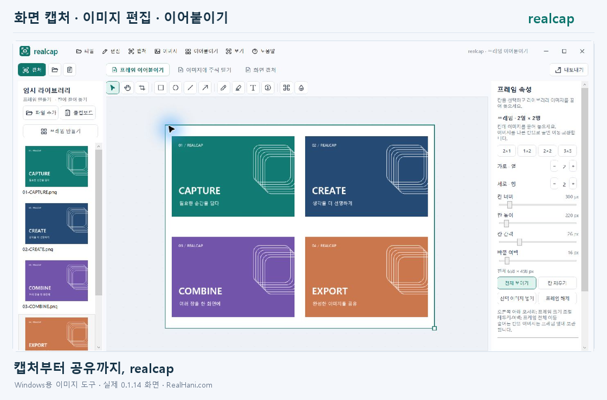
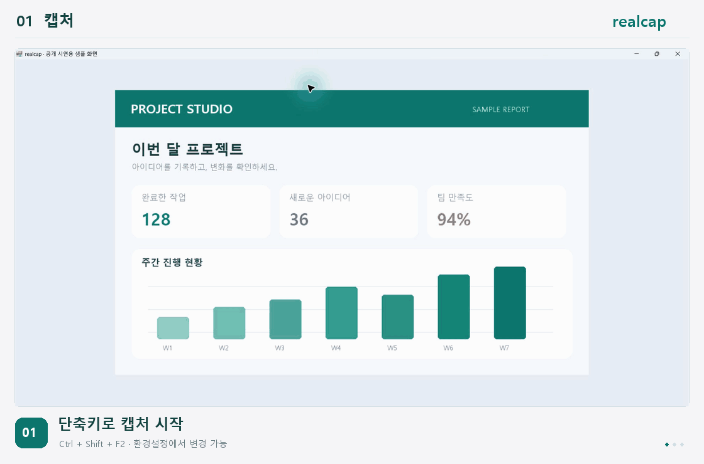
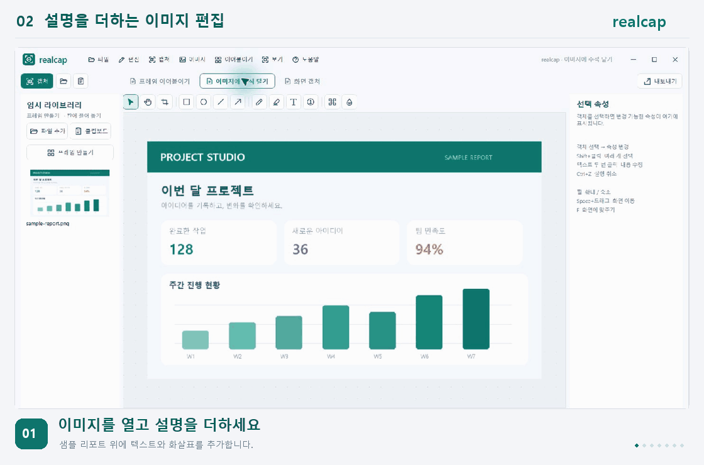
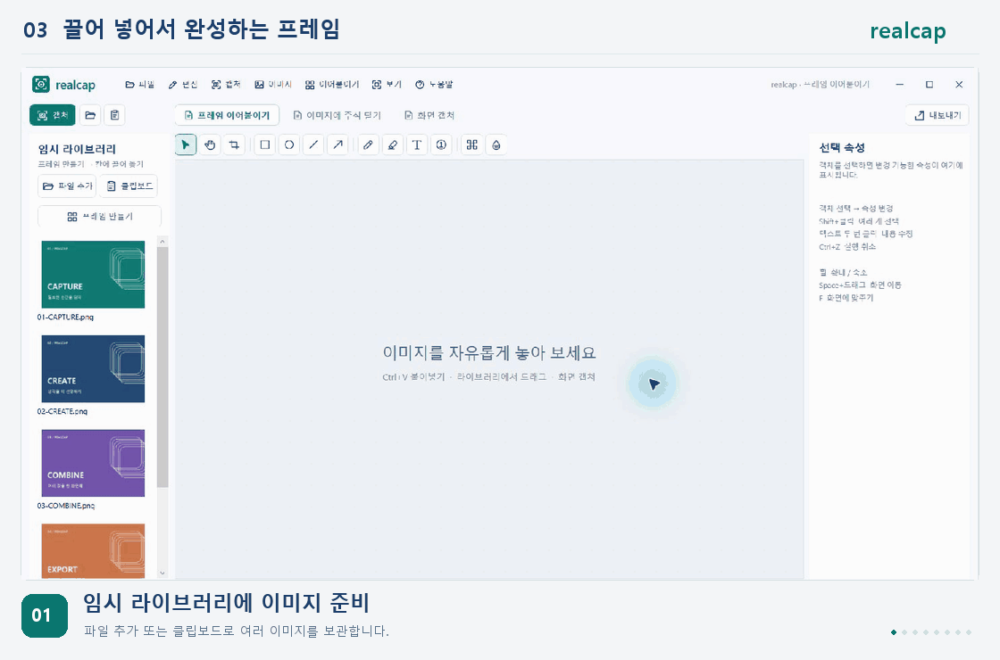
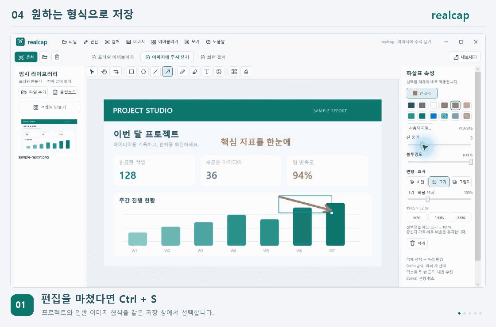

# realcap

**화면 캡처 · 이미지 편집 · 이어붙이기**

제작자: [RealHani.com](https://RealHani.com)

**[최신 버전 다운로드](https://github.com/yeonijae/realcap/releases/latest)** · [작동 모습 보기](#작동-모습)

Windows용 realcap의 공식 설치 파일 배포 저장소입니다. 사용 안내와 버전별 변경 내역을 제공하며, 프로그램 소스코드는 포함하지 않습니다.

## 설치

1. 위 다운로드 링크에서 `realcap-버전-Setup-x64.exe`를 받습니다.
2. 설치 파일을 실행하고 설치 위치와 바탕화면 바로가기 여부를 선택합니다.
3. 시작 메뉴에서 realcap을 실행합니다.

Windows 10/11 64비트와 .NET Framework 4.8 이상이 필요합니다. Python이나 별도 편집 프로그램은 필요하지 않습니다. 현재 설치 파일에는 코드 서명이 적용되어 있지 않습니다.

## 주요 기능

- 영역·전체 화면·창 캡처, 트레이 상주와 사용자 지정 캡처 단축키
- 텍스트·도형·화살표·펜·형광펜 주석, 자르기·회전·크기·그림자 조절
- 밝기·대비·색감 자동 보정과 개별 이미지 조정
- 파일·클립보드 이미지를 보관하는 임시 라이브러리
- 행·열과 간격을 조절하는 프레임에 이미지를 끌어 넣어 이어붙이기
- Ctrl+S로 realcap 프로젝트·PNG·JPEG·BMP 저장
- 환경설정에서 기본 저장 형식·캡처 옵션·단축키 변경

화면 녹화는 제공하지 않습니다. 스크롤 캡처는 콘텐츠에 따라 결과가 달라질 수 있는 실험 기능입니다.

## 작동 모습

realcap **0.1.14의 실제 Windows 화면**을 단계별 GIF로 구성했습니다. 화면 속 리포트와 카드 이미지는 시연용 샘플입니다. 각 GIF는 약 7~13초 동안 반복됩니다.

### 1. 필요한 화면만 캡처

다른 프로그램을 사용하다가 **Ctrl+Shift+F2**를 누르고 영역을 드래그하세요. 캡처 결과가 realcap에 들어오면 곧바로 편집할 수 있습니다. 전역 단축키는 환경설정에서 바꿀 수 있습니다.

[정지 화면 보기](assets/capture-still.png)

### 2. 글자와 화살표로 설명하기

**텍스트 도구 → 영역 드래그 → 글자 입력 → Ctrl+Enter** 순서로 주석을 만듭니다. 글자를 선택하면 글꼴·크기·굵기·색 등을 바로 변경할 수 있고, 드래그해서 위치를 옮길 수 있습니다. 화살표의 굵기도 슬라이더로 조절합니다.

[정지 화면 보기](assets/annotations-still.png) · [PNG로 저장한 결과](assets/annotation-result.png)

### 3. 프레임에 끌어 넣어 이어붙이기

임시 라이브러리에 이미지를 추가한 뒤 **프레임 만들기**를 누르세요. 원하는 칸에 이미지를 끌어 넣고 행·열, 칸 크기, 간격과 바깥 여백을 조절합니다. 이미지를 놓으면 축소 효과와 ‘추가 완료’ 표시가 나타납니다.

**붙여넣기**는 현재 작업에 독립된 이미지 객체를 추가합니다. **프레임 이어붙이기**는 여러 이미지를 칸에 맞춰 배치합니다. 임시 라이브러리에는 파일과 클립보드 이미지를 모두 넣을 수 있습니다.

[정지 화면 보기](assets/frames-still.png)

### 4. 프로젝트 또는 일반 이미지로 저장

**Ctrl+S**로 `.realcap`·PNG·JPEG·BMP 중에서 선택하세요. 이미지 저장 시에는 객체별 편집 정보가 합쳐진다는 안내가 나옵니다. **파일 → 환경설정 → 저장**에서 자주 쓰는 형식을 기본값으로 지정할 수 있습니다.

[환경설정 정지 화면 보기](assets/saving-still.png)

## 기본 단축키

| 단축키 | 기능 |
|---|---|
| Ctrl+Shift+F2 | 영역 캡처 |
| Ctrl+Shift+F3 | 전체 화면 캡처 |
| Ctrl+Shift+F4 | 창 캡처 |
| Ctrl+Shift+F5 | 마지막 영역 다시 캡처 |
| Ctrl+S | 저장 형식 선택 |
| Ctrl+, | 환경설정 |

PNG·JPEG·BMP는 글자·도형·이미지를 한 장으로 합쳐 저장합니다. 나중에도 각 객체를 편집하려면 `.realcap` 프로젝트를 함께 보관하세요.

## 업데이트와 데이터 보관

0.1.14부터 **도움말 → 업데이트 확인**에서 이 저장소의 최신 정식 버전을 확인할 수 있습니다. 새 버전이 있으면 변경 내용과 배포 페이지를 표시합니다.

**파일 → realcap 완전히 종료**로 앱을 종료한 뒤 새 설치 파일을 실행하세요. 창의 X 버튼만 누르면 트레이가 유지됩니다. 자동 다운로드·설치는 하지 않습니다.

설치판의 작업·라이브러리·설정은 `%LOCALAPPDATA%\realcap\data`에 보관되며, 덮어 설치하거나 앱을 제거해도 남습니다. ZIP 버전에서 옮길 때는 작업을 `.realcap` 프로젝트로 저장해 설치판에서 여세요.

각 릴리스의 `SHA256SUMS.txt`에서 설치 파일의 SHA-256 값을 확인할 수 있습니다. `Source code`로 표시되는 자동 압축 파일에는 이 저장소의 문서와 시연 이미지만 포함되며, 설치 파일은 아닙니다.
