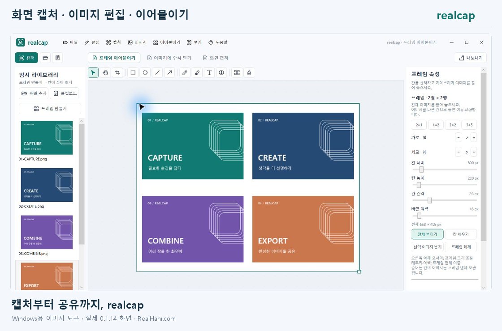
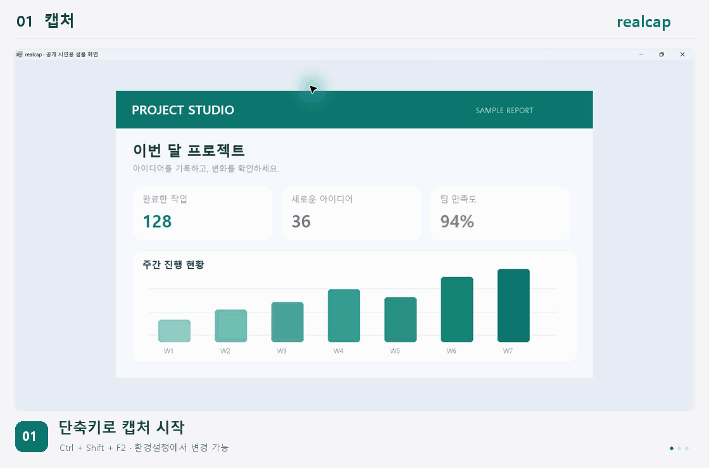
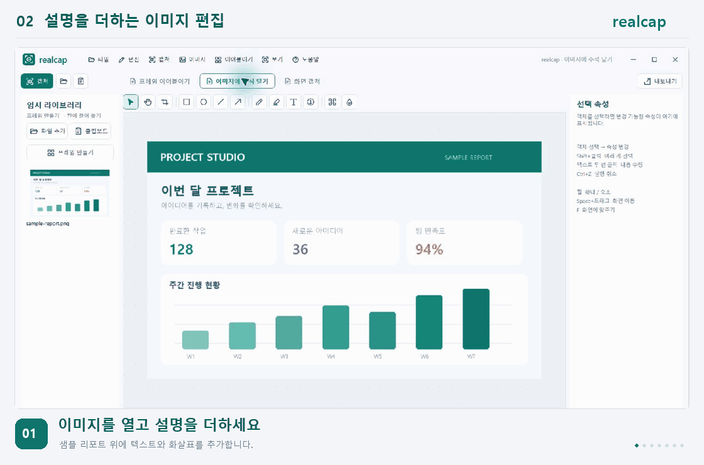
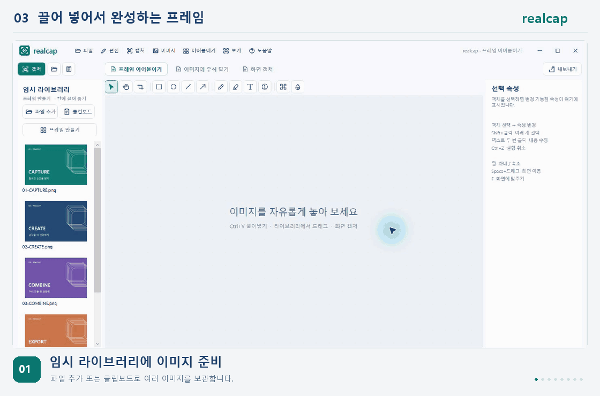

# realcap

**화면 캡처 · 이미지 편집 · 이어붙이기**

제작자: [RealHani.com](https://RealHani.com)

**[최신 버전 다운로드](https://github.com/yeonijae/realcap/releases/latest)** · [작동 모습 보기](#작동-모습)

Windows용 realcap의 공식 설치 파일 배포 저장소입니다. 사용 안내와 버전별 변경 내역을 제공하며, 프로그램 소스코드는 포함하지 않습니다.

## 설치

1. 위 다운로드 링크에서 `realcap-버전-Setup-x64.exe`를 받습니다.
2. 설치 파일을 실행하고 설치 위치와 바탕화면 바로가기 여부를 선택합니다.
3. 시작 메뉴에서 realcap을 실행합니다.

Windows 10/11 64비트와 .NET Framework 4.8 이상이 필요합니다. Python이나 별도 편집 프로그램은 필요하지 않습니다. 현재 설치 파일에는 코드 서명이 적용되어 있지 않습니다.

## 0.1.23 업데이트

[realcap 0.1.23 설치 파일 다운로드](https://github.com/yeonijae/realcap/releases/download/v0.1.23/realcap-0.1.23-Setup-x64.exe) · [변경 내용](https://github.com/yeonijae/realcap/releases/tag/v0.1.23)

- **라이브러리 보기**: 작은 이미지·파일명을 나란히 보는 리스트와 두 열의 미리보기 타일 중 선택합니다. 보기 전환 시 선택한 이미지를 유지하며, 보기 방식과 정렬을 기억합니다.
- **간결한 도구 배치**: 열기·클립보드·리스트·타일 아이콘을 라이브러리의 한 줄에 모았습니다. 검색창·미리보기 크기 슬라이더와 중복 상단 버튼을 제거하고 라이브러리·속성 패널을 위로 올렸습니다.
- **내보내기 형식 바로 선택**: 파일 → 이미지 내보내기 또는 Ctrl+Shift+S에서 미리보기를 확인하고 JPG·PNG·BMP·클립보드 아이콘을 고릅니다. 파일 형식을 고르면 해당 형식의 저장 창이 열립니다.
- **14색 팔레트**: 밝은 회색과 갈색을 추가하고 7개씩 두 줄로 배치했습니다.
- **많은 이미지 탐색**: 화면에 보이는 행과 인접 행 위주로 미리보기를 표시합니다. 리스트·타일 모두 다중 선택, 끌어 놓기, 삽입, 제거·복원을 지원합니다.

## 작동 모습

**캡처 · 이미지 편집 · 이어붙이기**, 세 가지 주요 기능을 **각 6~7초 GIF**로 안내합니다. realcap 0.1.14의 실제 Windows 화면과 시연용 샘플로 구성했습니다.

### 1. 캡처

**단축키 → 영역 드래그 → 바로 편집.** 기본 단축키는 Ctrl+Shift+F2이며, 환경설정에서 변경할 수 있습니다.

[정지 화면 보기](assets/capture-still.png)

### 2. 이미지 편집

**글자 입력 → 색·굵기 변경 → 화살표로 강조.** 객체를 선택하면 오른쪽에 속성이 표시되고 변경 내용이 바로 적용됩니다.

[정지 화면 보기](assets/annotations-still.png) · [PNG로 저장한 결과](assets/annotation-result.png)

### 3. 이어붙이기

**프레임 만들기 → 이미지 끌어 넣기 → 간격 조절.** 임시 라이브러리에는 파일이나 클립보드 이미지를 추가할 수 있습니다.

**붙여넣기**는 현재 작업에 독립된 이미지 객체를 추가합니다. **프레임 이어붙이기**는 여러 이미지를 칸에 맞춰 배치합니다. 임시 라이브러리에는 파일과 클립보드 이미지를 모두 넣을 수 있습니다.

[정지 화면 보기](assets/frames-still.png)

## 기본 단축키

| 단축키 | 기능 |
|---|---|
| Ctrl+Shift+F2 | 영역 캡처 |
| Ctrl+Shift+F3 | 전체 화면 캡처 |
| Ctrl+Shift+F4 | 창 캡처 |
| Ctrl+Shift+F5 | 마지막 영역 다시 캡처 |
| Ctrl+S | 저장 형식 선택 |
| Ctrl+Shift+S | JPG·PNG·BMP·클립보드 내보내기 선택 |
| Ctrl+C / Ctrl+V | 선택 객체 이미지 복사 / 붙여넣기 |
| Ctrl+, | 환경설정 |

PNG·JPEG·BMP는 글자·도형·이미지를 한 장으로 합쳐 저장합니다. 나중에도 각 객체를 편집하려면 `.realcap` 프로젝트를 함께 보관하세요.

**파일 → 환경설정 → 저장**에서 자주 쓰는 저장 형식을 기본값으로 지정할 수 있습니다. **캡처 → 단축키 설정 및 안내**에서는 현재 키·기본값·변경 방법과 편집 단축키를 확인합니다.

## 업데이트와 데이터 보관

0.1.14부터 **도움말 → 업데이트 확인**에서 이 저장소의 최신 정식 버전을 확인할 수 있습니다. 새 버전이 있으면 변경 내용과 배포 페이지를 표시합니다.

**파일 → realcap 완전히 종료**로 앱을 종료한 뒤 새 설치 파일을 실행하세요. 창의 X 버튼만 누르면 트레이가 유지됩니다. 자동 다운로드·설치는 하지 않습니다.

설치판의 작업·라이브러리·설정은 `%LOCALAPPDATA%\realcap\data`에 보관되며, 덮어 설치하거나 앱을 제거해도 남습니다. ZIP 버전에서 옮길 때는 작업을 `.realcap` 프로젝트로 저장해 설치판에서 여세요.

각 릴리스의 `SHA256SUMS.txt`에서 설치 파일의 SHA-256 값을 확인할 수 있습니다. `Source code`로 표시되는 자동 압축 파일에는 이 저장소의 문서와 시연 이미지만 포함되며, 설치 파일은 아닙니다.
